**（一）引言**
=========

在实际开发工作中，通常需要搭建maven私有仓库。

**（二）Nexus介绍**
==============

Nexus 是Maven仓库管理器，如果你使用Maven，你可以从Maven中央仓库 下载所需要的构件（artifact），但这通常不是一个好的做法，你应该在本地架设一个Maven仓库服务器，在代理远程仓库的同时维护本地仓库，以节省带宽和时间，Nexus就可以满足这样的需要。此外，他还提供了强大的仓库管理功能，构件搜索功能，它基于REST，友好的UI是一个extjs的REST客户端，它占用较少的内存，基于简单文件系统而非数据库。这些优点使其日趋成为最流行的Maven仓库管理器。

（三）**docker中安装nexus3**
======================

提示：可以去[docker hub网站](https://hub.docker.com/search "docker hub网站")搜索对应的软件，掌握docker命令如何写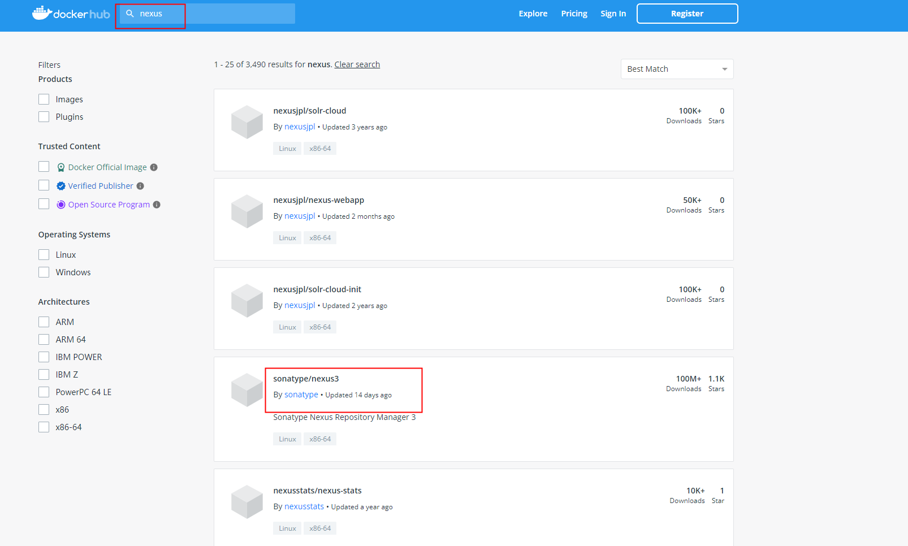

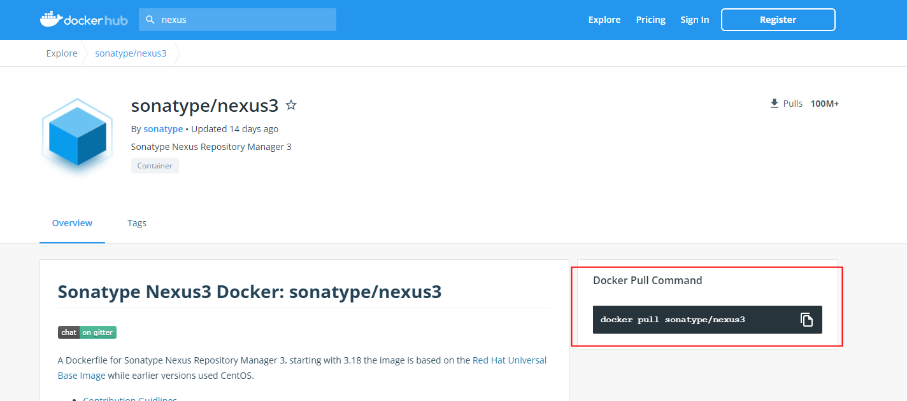

```bash
## 查看镜像
[root@kamalyes /]# docker images
REPOSITORY        TAG       IMAGE ID       CREATED       SIZE
sonatype/nexus3   latest    aab1398bb657   2 weeks ago   705MB
[root@kamalyes /]# 

```

2、**建立数据储存文件夹**
---------------

```bash
## 建立数据存放文件夹，用于docker中nexus的数据与本地物理机映射并更改权限
[root@kamalyes /]# mkdir -p /opt/nexus3/data & chmod 777 -R /opt/nexus3/data/
```

3、**安装并运行容器**
-------------

```bash
docker run --name nexus3 \
-p 8081:8081 \
-v /opt/nexus3/data:/nexus-data \
--restart=always \
-d sonatype/nexus3

## 参数说明
--name nexus #启动该容器的名字，可以自己更改为自己想要的名字
-p 8081:8081 #端口映射，将本地8081端口映射为容器的8081端口,第一个8081可以改成自己想要放开的端口
-v /docker/nexus/nexus-data:/nexus-data # 将容器的/nexus-data地址 代理到 本地/docker/nexus/nexus-data文件夹下
--restart=always #在重启docker时，自动重启改容器。
-d sonatype/nexus3 #即为后台运行一直sonatype/nexus3
```

4、**获取容器的日志**
--------------

```bash
[root@kamalyes nexus3]# docker logs -f --tail 20 nexus3
```

**（四）使用nexus3**
===============

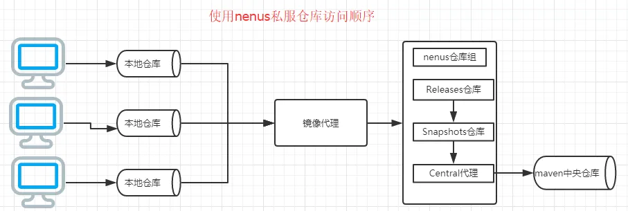

1、**浏览器访问**
------------

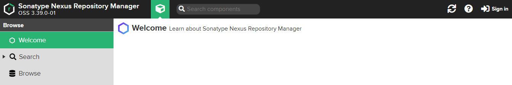

2、**配置Nexus**
--------------

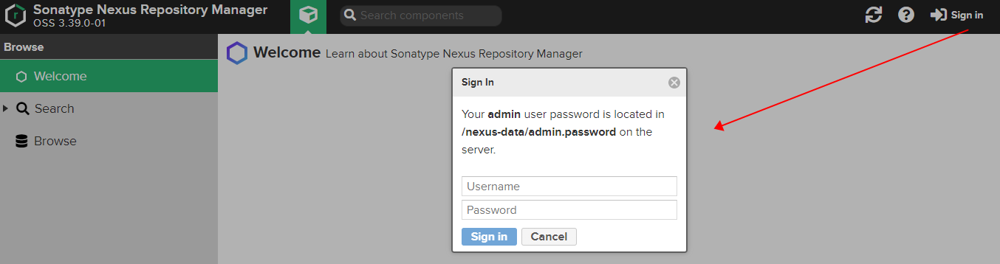

 提示输入密码，并告知你的密码储存位置

```bash
Your admin user password is located in /nexus-data/admin.password on the server.
```

因为docker中nexus3的数据储存位置与本地物理机建立了映射关系，所有在物理机上的地址应该是`/opt/nexus3/data/admin.password`

登录成功后需要更改密码，更改密码需要记住（浏览器都有记住密码的功能，顺⼿点保存⾯，下次你直接登录就好了）；更改密码完成之后，admin.password⽂件⾃动删除！！！

```bash
## 默认仓库说明
maven-central：maven中央库，默认从https://repo1.maven.org/maven2/拉取jar
maven-releases：私库发行版jar，初次安装请将Deployment policy设置为Allow redeploy
maven-snapshots：私库快照（调试版本）jar
maven-public：仓库分组，把上面三个仓库组合在一起对外提供服务，在本地maven基础配置settings.xml或项目pom.xml中使用
```

```bash
## Nexus仓库类型介绍
hosted：本地仓库，通常我们会部署自己的构件到这一类型的仓库。比如公司的第二方库。
proxy：代理仓库，它们被用来代理远程的公共仓库，如maven中央仓库。
group：仓库组，用来合并多个hosted/proxy仓库，当你的项目希望在多个repository使用资源时就不需要多次引用了，只需要引用一个group即可。
```

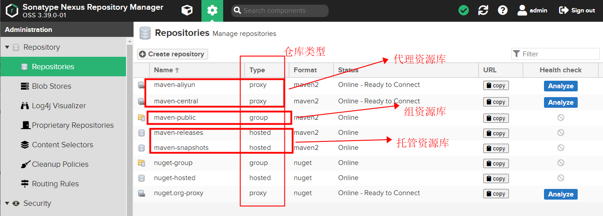

 如图所示，代理仓库负责代理远程中央仓库，托管仓库负责本地资源，组资源库 = 代理资源库 + 托管资源库

3、**配置阿里云代理仓库**
---------------

### 1）、新建仓库(Create repository)

Repository-->Repositories-->Create repository-->maven2(proxy)

填写仓库名称——maven-aliyun，并填入仓库url

[https://maven.aliyun.com/repository/public](https://maven.aliyun.com/repository/public "https://maven.aliyun.com/repository/public")

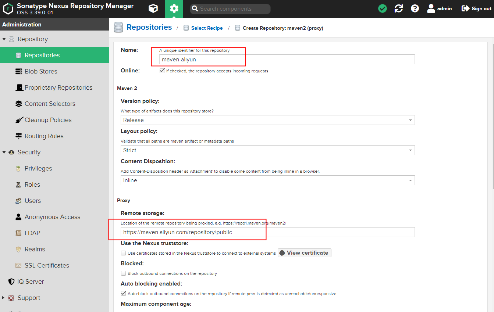

### 2）、配置仓库组

(默认已有一个maven-public)

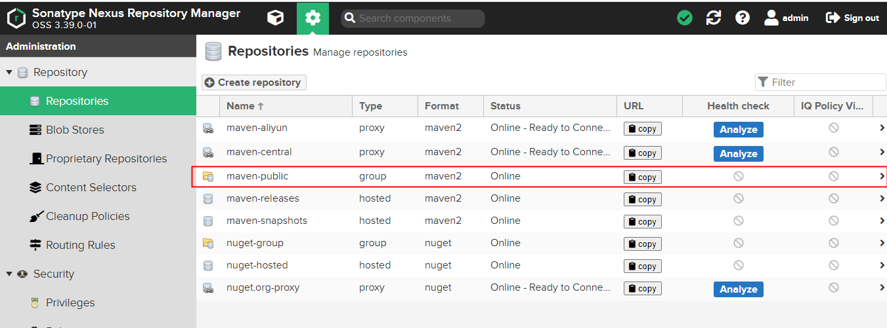

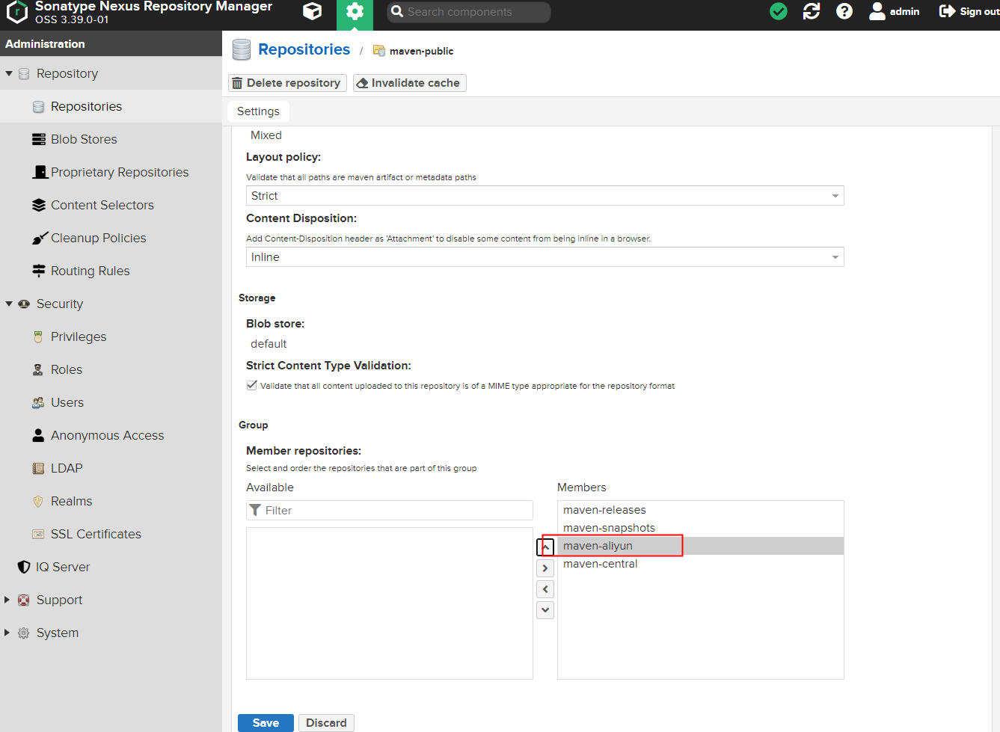

 注：注意仓库顺序。maven查找依赖时会依次遍历仓库组中的仓库。

```bash
## 官方文档中建议：
It is recommended practice to place hosted repositories higher in the list than proxy repositories. For proxy repositories, the repository manager needs to check the remote repository which will incur more overhead than a hosted repository lookup.
希望将hosted repositories【托管资源库】的顺序放在proxy repositories【代理资源库】之前，因为一个group【组资源库】中可以涵括这些托管资源库和代理资源库。而一整个的group是作为一个public，一个接口给别人使用的。所以当查找架包的时候，如果代理资源库在前面，那就是先从远程去查找jar，而不是先从托管资源库（本地仓库）去查找是否有jar。这样访问外网的消耗比起来在本地查找，当然是将托管资源库放在代理资源库之前的优先位置了。
```

**4、创建角色**
----------

创建角色（develop），并分配nx-all权限

Security-->Roles-->Create

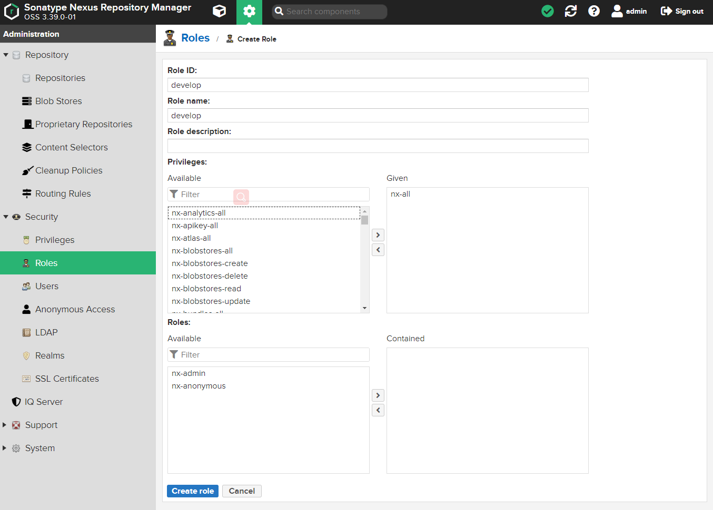

注：创建角色的同时可以为当前创建的角色分配权限。

5、**创建用户**
----------

创建用户（developer），并授予develop角色

Security-->Users-->Create

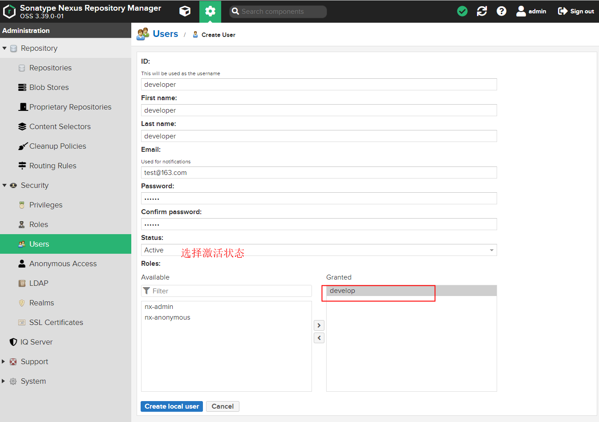

注：创建用户并为创建的用户挂上相应的角色。

（五）**maven配置文件**
================

Maven下的setting.xml文件和项目中的pom.xml文件的关系是：settting.xml文件是全局设置，而pom.xml文件是局部设置。pom.xml文件对于项目来说，是优先使用的。而pom.xml文件中如果没有配置镜像地址的话，就按照settting.xml中定义的地址去查找。

修改本地maven配置文件(conf/setting.xml)

servers节点下添加以下内容(username和password为刚刚在nexus3中添加的用户和其密码)

```bash
  <!--nexus服务器,id为组仓库name-->
  <servers>
 <server>
   <id>maven-public</id>
   <username>developer</username>
   <password>root</password>
 </server>
 <server>
   <id>maven-releases</id>  <!--对应pom.xml的id=releases的仓库-->
   <username>developer</username>
   <password>root</password>
 </server>
  <server>
   <id>maven-snapshots</id> <!--对应pom.xml中id=snapshots的仓库-->
   <username>developer</username>
   <password>root</password>
 </server> 
  </servers>
```

mirrors节点下添加以下内容

```bash
 <!--仓库组的url地址，id和name可以写组仓库name，mirrorOf的值设置为central--> 
  <mirrors>  
  <mirror>
  <id>maven-public</id>
  <name>maven-public</name>
  <!--镜像采用配置好的组的地址-->
  <url>http://182.92.199.85:8081/repository/maven-public/</url>
  <mirrorOf>central</mirrorOf>
 </mirror> 
  </mirrors>
```

（六）**项目中发布**
=============

pom.xml配置

实际使用中distributionManagement可以配置在parent项目中，子项目无需重复配置。

上述配置全部完成后就可以在项目中使用maven clean deploy将项目的jar包上传到自己的私服上了。

```bash
 <repositories>
        <repository>
            <id>maven-public</id>
            <name>Nexus Repository</name>
            <url>http://106.52.217.40:8081/repository/maven-public/</url>
            <snapshots>
                <enabled>true</enabled>
            </snapshots>
            <releases>
                <enabled>true</enabled>
            </releases>
        </repository>
    </repositories>
    <pluginRepositories>
        <pluginRepository>
            <id>maven-public</id>
            <name>Nexus Plugin Repository</name>
            <url>http://106.52.217.40:8081/repository/maven-public/</url>
            <snapshots>
                <enabled>true</enabled>
            </snapshots>
            <releases>
                <enabled>true</enabled>
            </releases>
        </pluginRepository>
    </pluginRepositories>
<!--项目分发信息，在执行mvn deploy后表示要发布的位置。有了这些信息就可以把网站部署到远程服务器或者把构件jar等部署到远程仓库。 -->
    <distributionManagement>
        <repository><!--部署项目产生的构件到远程仓库需要的信息 -->
            <id>maven-releases</id><!-- 此处id和settings.xml的id保持一致 -->
            <name>Nexus Release Repository</name>
            <url>http://106.52.217.40:8081/repository/maven-releases/</url>
        </repository>
        <snapshotRepository><!--构件的快照部署到哪里？如果没有配置该元素，默认部署到repository元素配置的仓库，参见distributionManagement/repository元素 -->
            <id>maven-snapshots</id><!-- 此处id和settings.xml的id保持一致 -->
            <name>Nexus Snapshot Repository</name>
            <url>http://106.52.217.40:8081/repository/maven-snapshots/</url>
        </snapshotRepository>
    </distributionManagement>
```
