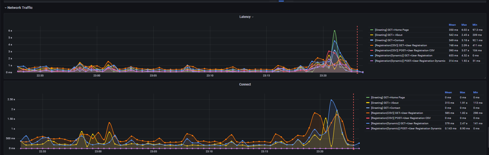

# JMeter InfluxDB v2.0 listener plugin


<p align="left">


<br>


</p>

### Packaging

Execute below mvn command. Make sure JAVA_HOME is set properly

```bash
mvn -B clean package -X -Dmaven.test.skip=true -Dmaven.javadoc.skip=true
```

## Description

The goal of the project is to make a quite similar online dashboard in the same way as JMeter generates. Supported the latest InfluxDB v2.0 and created appropriate dashboard ("Flux" language has been used to create the queries - now there are a lot fo capacities to build amazing charts, tables with a lot of math function).
So that it would be possible to build the monitor hardware solution on the latest InfluxDB v2.0 and telegraf (agent to send the hardware metrics to InfluxDB) as well.

The plugin sends metrics to InfluxDB and provides the possibility to visualize the charts in Grafana, have the Aggregate report as JMeter creates. Added the possibly to save the following extra fields in the database:

* Response code;
* Error message;
* Response body of the failed requests (can be configured);
* Connect time;
* Latency;
* The response time (uses from the SampleResult.class, needs to make aggregate report).

Notes: if you need to save the errors you got wile the test to csv like file and then share to the dev team you can use the [jmeter-csv-backend-listener](https://github.com/kamalyes/jmeter-csv-backend-listener).
This plugin can be used while the functional testing and load tests as well.

## Important notes

🚨 The plugin allows 5 errors happened one by one, then plugin will stop importing the results after that! See details in the logs.
Counter will be refreshed at least you have 4 fails. This is protection to avoid OOM error.
The option can be configured in the settings (the key name is `influxDBThresholdError` see the [Plugin configuration](https://github.com/kamalyes/jmeter-influxdb-backend-listener/tree/v2#plugin-configuration) for the details). You need to be careful with that option and know the hardware resources to store data in the memory.

Pleas monitor the elapsed time of the data importing (see logs) to avoid issues with requests sending from JMeter.
Pay attention on "Sending metrics performance tuning" chapter, see below.

## Compatibility

The supported versions:

* Java 11 - make sure that you have it (its minimum version).
* InfluxDB v2.x, see release notes: <https://docs.influxdata.com/influxdb/v2.0/reference/release-notes/influxdb/>  (1.8 is not supported)
* JMeter 5.5.0 only.

* The current board and plugin were tested on Grafana 9.1.6 and InfluxDB 2.2.0, JAVA 15.

## Maven Support

Please see the latest release here <https://search.maven.org/artifact/io.github.kamalyes/jmeter-plugins-influxdb2-listener>.

## CI/CD Support

The CI/CD can be done using [jmeter-maven-plugin](https://github.com/jmeter-maven-plugin/jmeter-maven-plugin)
The example of the adding plugin to the project with the jmeter-maven:

```bash
<configuration>
  <jmeterExtensions>
    <artifact>io.github.kamalyes:jmeter-influxdb-backend-listener:2.0.0</artifact>
  </jmeterExtensions>
</configuration>
```

Some notes cab be found in the article [Adding jar's to the /lib/ext directory](https://github.com/jmeter-maven-plugin/jmeter-maven-plugin/wiki/Adding-Excluding-libraries-to-from-the-classpath).

## Development and branching strategy

Hello all contributors! Welcome to the project, I'm happy to see you here. Just to avoid the mess and have a nice history, let's keep the simple rules:

1. Code should pass standard static code analysis in IntelliJ IDEA.
2. Comments should be for the new code to have clear java docs.
3. All new development lets - in the "development" branch. So the steps:
   a. make a branch for the feature you want to develop from "development" (source branch -> "v2.0.0"). There will be a mirror of the latest release + can be a merge of the new features.
   b. all pull requests from your feature branch -> "development" branch only.
   c. once we decide to make the new release after testing, we will merge "development" -> "v2.0.0" with push to maven central.

## Deployment

* Put '`jmeter-influxdb-backend-listener-<version>.jar`' file from [Releases](https://github.com/kamalyes/jmeter-influxdb-backend-listener/releases) to `~<JmeterPath<\lib\ext`;

Note: "fatJar" gradle task should be used to create the package for the JMeter.

  

* Run JMeter and select the test plan, Add-> Listener -> Backend Listener.

  

* Go to Backend Listener
  
  
  
* Select from the dropdown item with the name '`io.github.kamalyes.influxdb2.client.JmeterInfluxDBBackendListenerClient`'.

## Upgrade

* Close JMeter if its started.
* Remove old jar.
* Put '`jmeter-influxdb-backend-listener-<version>.jar`' file from [Releases](https://github.com/kamalyes/jmeter-influxdb-backend-listener/releases) to `~<JmeterPath<\lib\ext`;
* Run JMeter again and got Listener.
* Select from the dropdown item with the name '`io.github.kamalyes.influxdb2.client.JmeterInfluxDBBackendListenerClient`'.
  
* Click 'Clear all' button

  
* Set right settings (update all properties).

## InfluxDB configuration

* Create Bucket to store the further testing results.

  
  
* Create the token with read and write rights.
  

## Plugin configuration

Let’s explain the plugin fields:

* `testName` - the name of the test.
* `nodeName` - the name of the server.
* `runId` - the identification number of hte test run, can be dynamic.
* `influxDBUrl` - InfluxDB server URL [protocol://][host][:port], protocol (can be http or https) and the default port is 8086.
* `influxDBToken` - the influxdb bucket token, the default value should be updated, copy it from InfluxDB site.

  
  
* `influxDBOrganization` - the influxdb bucket organization, the default value should be updated, copy it from InfluxDB site.

  

* `influxDBFlushInterval` - its interval to send data to InfluxDB, the default value is 4000 (4 seconds).
* `influxDBMaxBatchSize` - the max size of the batch with metrics, the default 2000 (2000 items of JMeter results).
* `influxDBThresholdError` - the error threshold before stopping the import, the default value is 5. (see [Important notes](https://github.com/kamalyes/jmeter-influxdb-backend-listener/tree/v2#important-notes) for more detail.)
* `influxDBBucket` - the InfluxDB bucket name to store the test results.
* `samplersList` - the regex value to sort out the JMeter samplers results; the default is _`.*`_. For example if you have the pattern of JMeter test plan development like this - create the 'Transaction controller', add inside of the 'Transaction controller' the Sampler with request, and the name pattern '`GET->Something`', like on the see screen below.
The regex `^(Home Page|Login|Search)(-success|-failure)?$` can be used to save only samplers names. The regex can be generated from JMeter menu.

  

You can modify the generated string in terms of your purposes.

  

* `useRegexForSamplerList` - allows to use the regexps if set to 'true'.
* `recordSubSamples` - allows to save the JMeter sub samples if set to 'true'.
* `saveResponseBodyOfFailures` - allows to save the response body of the failures.
* `responseBodyLength` - allows saving the response body, not more than the set specified length.

## Sending metrics performance tuning

The plugin imports batch with JMeter results each 4 seconds (by default settings). In the logs you will see records like this:
`INFO o.m.j.i.v.InfluxDatabaseBackendListenerClient: Data has been imported successfully, batch size --> 68, elapsed time is --> 14 ms` (the elapsed time is the response time of the batch importing.)
So you can control the flush interval depends on the load you have and adjust `influxDBFlushInterval` setting. Is not recommended having less 1 second.  
Max batch protection -> send data when batch max size is occurred. For example, when batch size is 2000 items (it's the default setting of `influxDBMaxBatchSize`) plugin imports that batch, even when flush interval was not occurred.
Using both options you can tune data importing and have optimal performance.

Make sure you have enough ram to aggregate huge batch and optimal flush period.

Notes: when test has been interrupted from UI; the processes may not be finished properly, restart JMeter.

## Grafana dashboard capabilities

Dashboard helps:

* Filter the results by Run Id or Type (can be requests or transactions).

   
 

* Monitor throughput with active users.
  

* Overview and analise the response time, distribution as well. Added the filters to see requests with status "pass", "fail".
  
  
  
* See aggregate report.
  The table rendering may take an extra time. The table has hardware resources consuming queries from Influxdb side. If you have low hardware on the Influxdb server - recommended make the clone of the original dashboard and remove aggregate report.
  So the idea - it's to have one 'fast' dashboard for the online monitoring (has no aggregate report) to see the results while the test, the second (original with aggregate report) to see the final results.
  

  Now added the possibility to see the aggregate report for requests with status "pass" only.
  

* Investigate errors. The table is interactive, it's possible to filter data in the columns and see details for the specific error. Added the paging.
  
  
* See network statistics, latency, processing time.
  
  
  

* Check individual request details.
  
